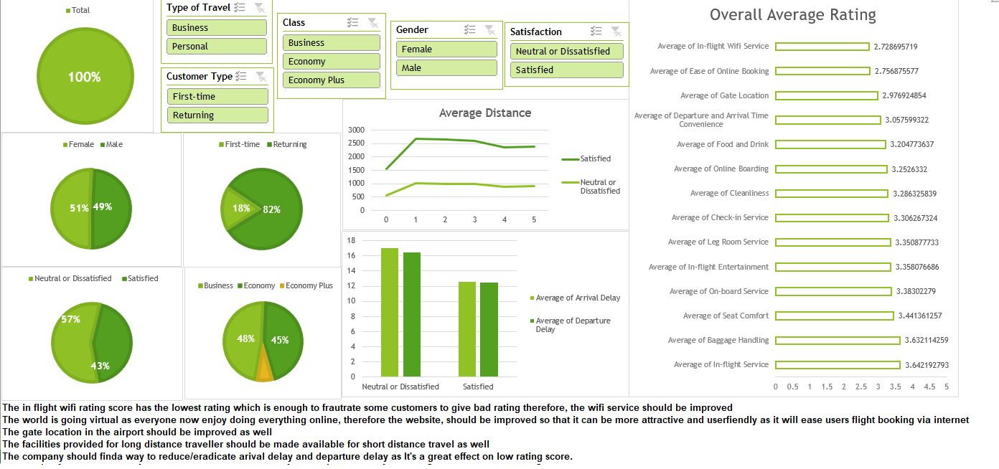

# [Mavin-Analytics-Challenge-by-Abdulateef-Sanni](https://latsan.github.io/Mavin-Analytics-Challenge-by-Abdulateef-Sanni/)

Sample datasets hand-picked by Maven instructors for practicing data analysis and visualization skills to real-world data.
## Airline Passenger Satisfaction
## Scenario
Customer satisfaction scores from 120,000+ airline passengers, including additional information about each passenger, their flight, and type of travel, as well as ther evaluation of different factors like cleanliness, comfort, service, and overall experience.

## Business Goal

* Recommend a data-driven strategy for increasing Maven Airlines' satisfaction rate, and present it in the form of a single-page report or dashboard.
   
### Intro
   
The data is a public data gotten from Maven Analytics Airlines Challenge which consists of customer satisfaction scores from 120,000+ airline passengers, including additional information about each passenger, their flight, and type of travel, as well as their evaluation of different factors like cleanliness, comfort, service, and overall experience.

 
### Analysis, assumption, recommendations & Proof:

 * The in-flight WiFi rating score has the lowest rating which is enough to frustrate customers to give a bad rating score and not satisfied with the journey therefore, the WiFi service should be improved.
 * The world is going virtual as everyone now enjoys doing everything online, therefore the website should be improved so that it can be more attractive and user-friendly as it will ease users' flight booking via the internet (online flight booking rating score was poor as well).
 * The gate location in the airport should be improved as well.
 * The facilities provided for long-distance customers should be made available for short-distance travel as well as the data shows customers going on a long-distance journey are more satisfied than customers going on a short distance journey
 * The company should find a way to reduce/eradicate arrival delay time and departure delay rime as It's a great effect on low rating scores.

          
