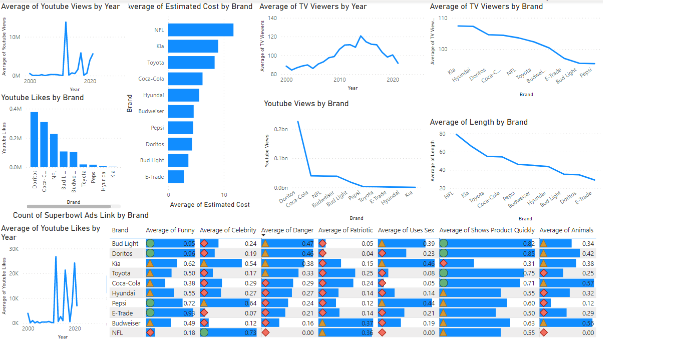
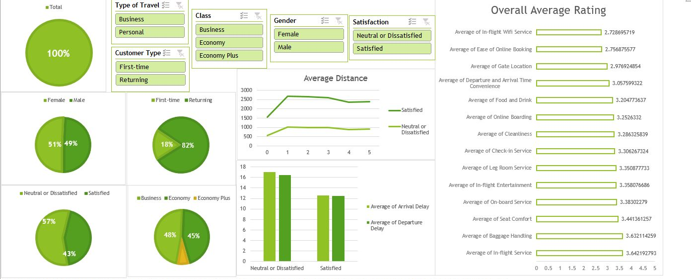

# [Mavin-Analytics-Challenge-by-Abdulateef-Sanni](https://latsan.github.io/Mavin-Analytics-Challenge-by-Abdulateef-Sanni/)

### Sample datasets hand-picked by Maven instructors for practicing data analysis and visualization skills to real-world data.

# Case Study 1 Super Bowl commercials
### Scenario

* Super Bowl commercials for 10 popular brands from 2000 to 2021, including links to each and additional information about the length, estimated cost, YouTube statistics, TV viewers, and defining characteristics.
Recommended Analysis
    ### Buiness Goal
  *  Which brand has had the most Super Bowl commercials? Do they have a distinct style?

  *  How have different characteristics for commercials trended across time?

  *  Can you identify any patterns for the most successful commercials on YouTube?

  *  Which characteristics are paired most often? Can you find any unusual combinations?

### Recomendation & Assumption

* 1.Bud Light has the most super bowl commecials by having 62 super bowl ads link
 There distinct style is to create ads with a short time making it possible for them to spend less money on each ads at they can create more ads.
* 2.There are youtube viewers in 2012 leading to more youtube likes in 2012 and this could be as a result of have more ads created in 2012 as it shows that in 2009,2012,2013 and 2019, 15 ads were created each in those years.
The number of tv viewers rally up from 2000 till 2014 and dropped significantly from 2014 to 2021 making 2014 the years of highest Tv views.
* 3.The most succesful comercial on Youtube is **Doritos** as their ads is very funny (most funny brand in creatings ads) and also their ads shows the products they are advertising quickly without wasting viewers time (Doritos ads are very short)
* 4.Ads length and ads view is the most paired characteristics

## Case Studay 2 Airline Passenger Satisfaction
### Scenario
Customer satisfaction scores from 120,000+ airline passengers, including additional information about each passenger, their flight, and type of travel, as well as ther evaluation of different factors like cleanliness, comfort, service, and overall experience.

## Business Goal

* Recommend a data-driven strategy for increasing Maven Airlines' satisfaction rate, and present it in the form of a single-page report or dashboard.
   
### Intro
   
 * The data is a public data gotten from Maven Analytics Airlines Challenge which consists of customer satisfaction scores from 120,000+ airline passengers, including additional information about each passenger, their flight, and type of travel, as well as their evaluation of different factors like cleanliness, comfort, service, and overall experience.

 
### Analysis, assumption, recommendations & Proof:

 * The in-flight WiFi rating score has the lowest rating which is enough to frustrate customers to give a bad rating score and not satisfied with the journey therefore, the WiFi service should be improved.
 * The world is going virtual as everyone now enjoys doing everything online, therefore the website should be improved so that it can be more attractive and user-friendly as it will ease users' flight booking via the internet (online flight booking rating score was poor as well).
 * The gate location in the airport should be improved as well.
 * The facilities provided for long-distance customers should be made available for short-distance travel as well as the data shows customers going on a long-distance journey are more satisfied than customers going on a short distance journey
 * The company should find a way to reduce/eradicate arrival delay time and departure delay rime as It's a great effect on low rating scores.

          

